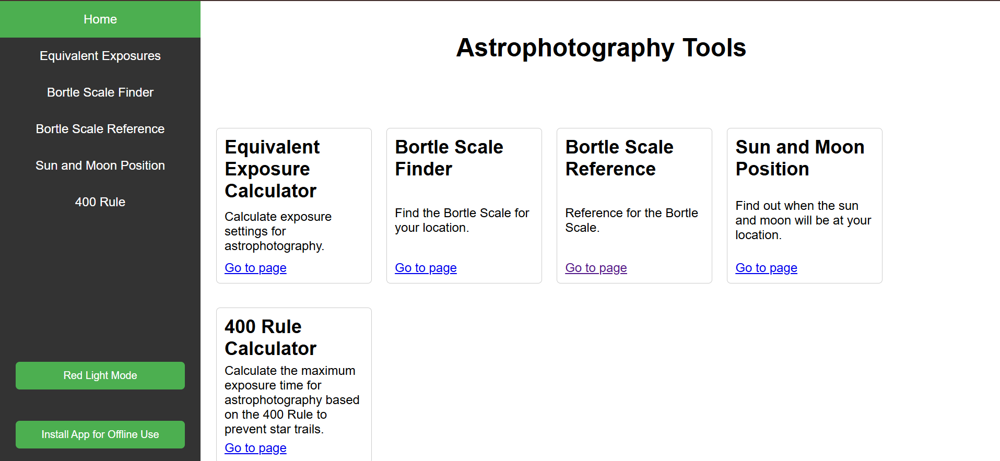
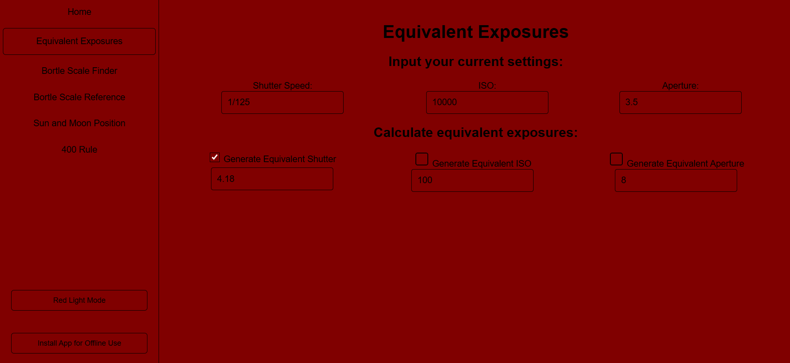
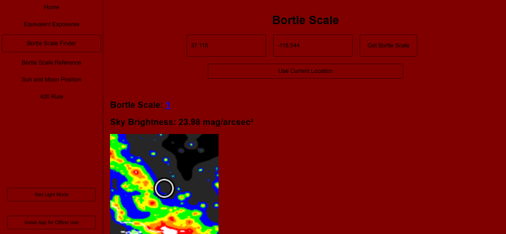
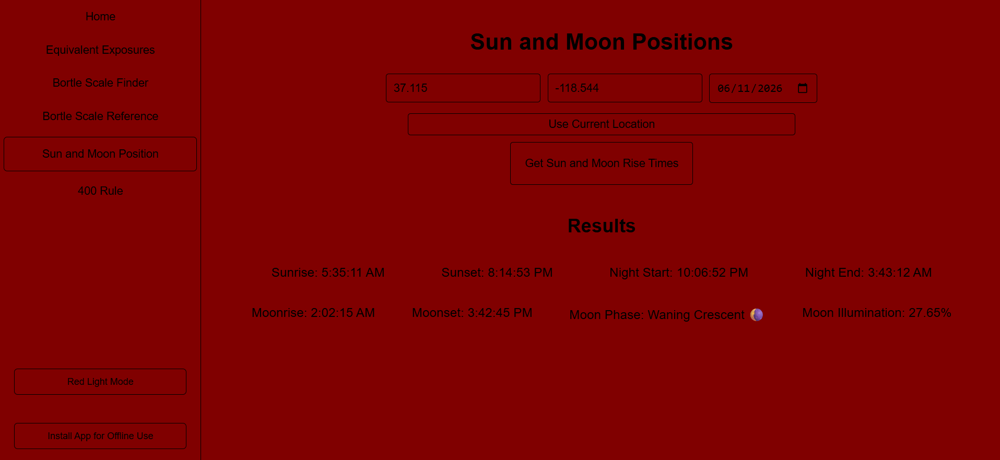
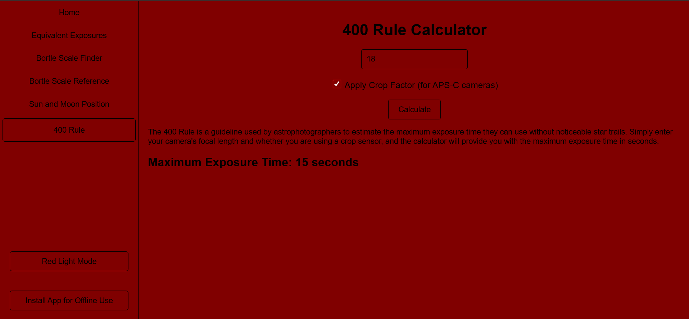

# Astrophotography Tools
## An all-in-one set of tools to help capture stunning photos of the night sky (with offline availibility)

| Equivalent Exposures | Bortle Finder | Sun and Moon Position | 400 Rule |
| :--- | :--- | :--- | :--- |
|  |  |  |  |

Try Now: [astrophoto-tools.vercel.app](https://astrophoto-tools.vercel.app/)

### Tools
- Red Light Mode

View the website in all red to preserve night vison

- Equivalent Exposures

Calculate the equivalent exposure of a scene from previous settings

- Bortle Finder

Find the night sky darkness at your location

- Bortle Reference

Reference what a Bortle Scale would look like for actual field photographs

- Sun And Moon Position

Find out the sunrise, sunset, moon rise, moon set, moon phase, etc on a day

- 400 Rule

Find the maximum shutter speed to prevent star trails

### Credits
- [mourner](https://github.com/mourner) for [SunCalc](https://github.com/mourner/suncalc)